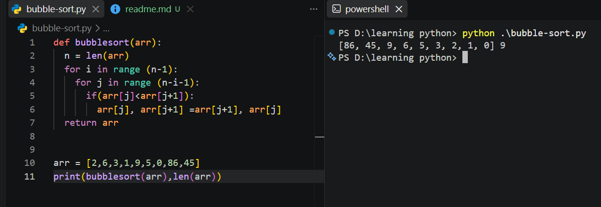

Bubble sort is a simple sorting algorithm that repeatedly compares adjacent elements and swaps them when they are in the wrong order. It continues making passes through the list until all elements are arranged from smallest to largest.

