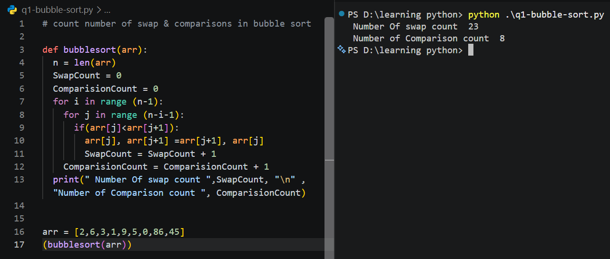
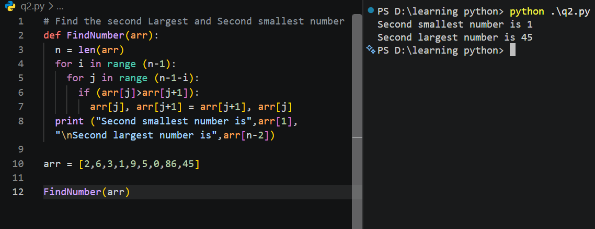

# Bubble sort
 is a simple sorting algorithm that repeatedly compares adjacent elements and swaps them when they are in the wrong order. It continues making passes through the list until all elements are arranged from smallest to largest.

 
 Question 1 is solved , Ask by ProDesk IT
# count number of swap & comparisons in bubble sort.

Question 2 is solved
# Find the second Largest and Second smallest number

## Lists / Arrays SOLVED

1. **Find the sum of all numbers in a list** without using `sum()`.
2. **Find the largest element in a list** without using `max()`.
3. **Find the smallest element in a list** without using `min()`.